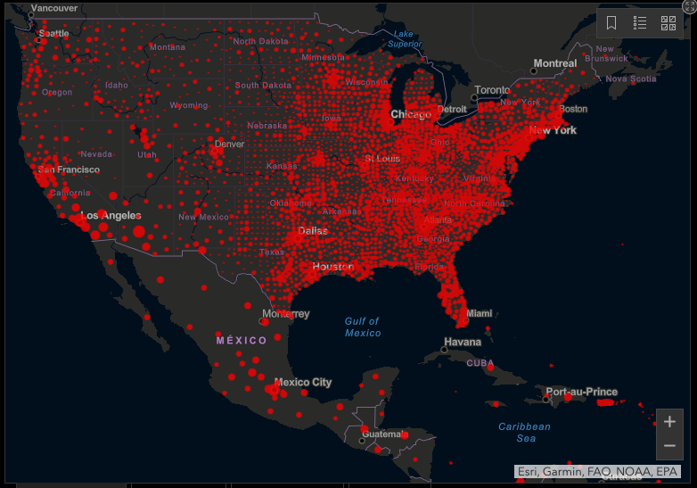

# COVID-19-ArcGIS-Dashboard-Essay
Thomas Kakatsakis  
Final essay for course Geography 458 at the University of Washington, analyzing the COVID-19 Dashboard by the Center for Systems Science and Engineering (CSSE) at Johns Hopkins University (JHU).
Link: https://gisanddata.maps.arcgis.com/apps/opsdashboard/index.html#/bda7594740fd40299423467b48e9ecf6

## Introduction and Context

SARS-CoV-2, COVID-19, or simply the Coronavirus pandemic, has fundamentally altered the lives of billions of people around the world. As the virus has rapidly spread across communities and nations, a tremendous quantity of data has been created, distributed, and analyzed by organizations and governments around the world. One of the most well known mediums of data involving the count and locations of COVID-19 confirmed cases and deaths is a notable interactive web-based dashboard. Hosted by the Center for Systems Science and Engineering (CSSE) at Johns Hopkins University (JHU), the COVID-19 Dashboard has and visualized real-time data for millions of people. The data chosen to display in the dashboard has evolved with the pandemic, and is also available via an ESRI Living Atlas and a Github repository. The data is aquired from a massive list of available global sources, aggregated into a single medium to visualize and understand the spread of disease. This dashboard has enabled open access to large swaths of data in a comprehensive disease tracking effort.

## Functions

The functions of the COVID-19 Dashboard have evolved with the pandemic, however it has always emphasized an objective and effective display of infection and mortality information. First and foremost, the dashboard provides a count of global cases, and global deaths. This ongoing count quantifies how a disease is collectively impacting humanity. In addition to the global counts, tables show the countries which have the highest cases and deaths, in decreasing order of count. This emphasizes where the virus has hit the hardest, and allows for a quick comparison of how different countries have been affected. The United States of America has topped both lists since April 2020.

In addition to these two notable columns of cases and deaths, the dashboard displays a few additional columns of data, which have changed since the onset of the pandemic. In March 2021, the third major column included displays data at a U.S. state level, with the number of deaths, recoveries, and test results by state. The emphasis on the United States could speak to the fact that the Johns Hopkins University is located in the U.S., much of the audience of the dashboard is based in the U.S., and many indvidual states have been impacted so badly by the pandemic that their numbers resemble those of entire countries. Part of this evolving coverage is due to what data exists at the time, as test results data by state is a relatively recent available data source.

The function at the center of the dashboard, and arguably its most significant component, is an interactive map of COVID-19 data. The map defaults to a global view, choropleth map which uses red dots of varying sizes to depict the number of cumulative cases by geographic subdivision (primarily national borders). The map allows for the user to pan, zoom, change the basemap, and interact with popups. Notably, the map lacks some traditional web map elements including a scale bar or North arrow, and the legend is initially hidden. Tabs at the bottom of the map allow for the viewer to change the variable being mapped, with current choices of “Cumulative Cases,” “Active Cases”, “Incidence Rates”, “Case-Fatality Ratio”, and “Testing Rate”. These variables have again evolved throughout the pandemic and data sources has emerged, initially giving the options of “Cases” and “Deaths”. Health mapping is a valuable tool to understand and combat disease, and the mapping of the COVID-19 pandemic in this dashboard will be remembered as one of the most notable applications of it.

Additional features which are tucked into the dashboard include a graph displaying aggregated data over time. It can be set to display “Daily Cases”, “Daily Deaths”, “Cumulative Cases”, “Cumulative Deaths”, and “Log Cases”. This visualization is a significant component which the dashboard otherwise does not contain, to display the effects of the pandemic over time. In addition, another section displays when the dashboard was last updated, giving a timestamp. This is an important consideration for anyone using the data, as it is updated in near real time. Lastly, a long list of text containing many links to various exterior sites describes all data sources, documentation, methodology, clarification of terminology, terms of use, and related resources. This information is necessary to validify the information being displayed on the dashboard.

## Authors and Audience
The dashboard is officially created by the Center for Systems Science and Engineering (CSSE) at Johns Hopkins University (JHU) [link](https://systems.jhu.edu/). This team is housed within the Johns Hopkins Department of Civil and Systems Engineering, and utilize the expertise of researchers from various departments and disciplines at JHU. The lead researchers who are listed as authors on the academic article describing the dashboard are Ensheng Dong, Hongru Du, and Lauren Gardner. In addition to the lead team, technical support is attributed to the JHU Applied Physics Laboratory [link](https://www.jhuapl.edu/), and the ESRI Living Atlas team link [link](https://livingatlas.arcgis.com/en/home/). A large team of individuals supports and makes this dashboard possible.

The audience of the dashboard is not explicitly stated. The data is open use and encouraged to be viewed and downloaded by any interested parties. As the Coronavirus pandemic has impacted the lives of nearly everyone, a large range of people will be interested in better understanding its outbreak. Individuals who are interested or anxiously watching the spread of the disease can easily understand it through the web medium of the dashboard. In addition, the data provided by the dashboard is undoubtedly utilized by various organizations. Numerous applications exist for utilizing this information in the respective contexts of interested parties, and the audience contains any group who relies on the information provided by the dashboard. In the initial academic article describing the dashboard it is stated that “We believe our efforts are crucial to help inform modelling efforts and control measures during the earliest stages of the outbreak.” (Dong et. al. 2020), speaking to the fact that they intended for their data to be used by to better understand and fight the damages of the virus. Lastly, they state that “We declare no competing interests”, speaking to the fact that this data is objective and for the public to better understand COVID-19.

## Data Sources
Data is utilized for this dashboard from a tremendously long list of sources. The ambitious task of cataloging every single confirmed case and death of COVID-19 relies on a variety of sources across the globe. The dashboard is transparent about where they are obtaining data, linking every utilized source on their Github README. https://github.com/CSSEGISandData/COVID-19/blob/master/README.md. Aggregated data sources involve organizations which are actively tracking and aggregating infection data, and each aggregated source relies on their own sources and methods. In addition to the short list of key aggregated data sources, sources at the country/region (Admin0) or state/province (Admin1) level are also utilized, split between the United States and all other nations. These more localized sources are essential to displaying data as it is distributed by geographic boundaries. While all sources are listed, the methodology of incorporating each of their information into a real-time dashboard is not explicitly described.

 Data Sources:

## Systematic Architecture

The COVID-19 Dashboard relies on a complex architecture, mostly hidden from the public, in order to aggregate health data from such a massive collection of sources. The sophisticated methodology culminates in a single, easy to read dashboard. The client in this case can be any device which accesses the publicly available site. The data is quickly and easily displayed, using the functions described above in a compact, mobile friendly page. From simply viewing the site in a browser, the data is not shared but simply shown. However, data is available from two sources. The data can be obtained from the Github page (link: https://github.com/CSSEGISandData/COVID-19) as well as the ArcGIS feature layer (link: https://www.arcgis.com/home/item.html?id=c0b356e20b30490c8b8b4c7bb9554e7c). The Github page archives previous data available for download, though it has not been recently updated. The ArcGIS feature layer provides spatial data available for download, which can be viewed in an ArcGIS online mapping platform, added to a users existing maps in ArcGIS online as a feature, or downloaded for offline mapping in ArcGIS Pro, QGIS, or similar.
When opening the inspect tool on the dashboard on a browser, some information can be gained about the server and processes being utilized. A pair of Javascript files from ESRI does much of the heavy lifting, linked at:
 *‘https://js.arcgis.com/3.35/init.js’
 *‘httpse://gisanddata.maps.arcgis.com/apps/opsdashboard/assets/amd-loading-02cbfb85f129b9c95536fe053a9457cb.js’.
This generates the map and adds in the data, but provides no documentation except for the terms of use. The remainder of the inspectable code pertains to divisions, which separate the different components of the dashboard.

Speculating on the backend systematic architecture, it is likely that the Center for Systems Science and Engineering (CSSE) has an automated steady flow of data from its many sources. This data comes in many different forms and mediums, either being scraped from web pages, obtained via an API, sent directly from the organization to Johns Hopkins University, or some other method of data transfer. The data is combined into a single workable type and location, and a sophisticated algorithm likely constantly allocates new counts to respective geographic areas within a database, generating the aggregated CSSE version of the data. There is likely overlap from various sources, and the program, designed and supervised by experts in their fields, must be able to correctly sort through the data and estimate the exact count of COVID cases and deaths for every nation on Earth. From there, the dashboard is constantly refreshing from this CSSE database, and displaying the most recent data to clients accessing the site.
## UI/UX and Web Mapping design

The COVID-19 Dashboard does an excellent job of packing a lot of information in a small space. The integrated maps, tables and charts all fit together in a single window to display the current realities of the COVID-19 pandemic. The design is somewhat responsive, allowing for the user to click through different forms of the data, and interact with and slightly customize the map. However it is not responsive in that there is a fixed number of variables which can be displayed, and the dashboard does not go in depth into the nuances of the spread of disease beyond the base level counts and mapping it provides. Taking up a single page is both a strength and weakness of its design; the information being displayed is compact and apparent. However it is limited to what fits on a single page.

Example of a customizable feature of the map.

Analyzing the mapping component of the dashboard, the default basemap is dark and non-descriptive, emphasizing country names and borders. The simple basemap is very intentional in order to highlight the choropleth data being overlaid with countries. The webmap allows for the user to modify the basemap being displayed, however the default basemap is most effective at presenting the data. The thematic layers clearly and effectively express the data being shown, relying primarily on the size of the dots to display their values. The preset bookmarks tab allows the user to jump around the map to pre-set notable locations, or simply pan around and interact with the map however they may choose. The simplicity and interactability of this map is its biggest strength, as a variety of different users can get different takeaways from using it. Another key strength of the interactive map lies in its pop ups, allowing the user to click and identify countries, along with a value for the data being displayed.

# Conclusion and Reflection
The COVID-19 Dashboard is a highly sophisticated and impressive utilization of data which reflects circumstances unique to this time in history. First and foremost, the COVID-19 pandemic has fundamentally changed society across the globe, and the dashboard somewhat depicts its influence. Among other effects, the pandemic has led increased authority and regulation from governments as they attempt to contain the spread of disease. This has undoubtedly helped save lives as individuals and business simply will not shut down normal operations without being required to, however in certain situations this has also led to an abuse of power and authoritarian governmental efforts. (Thompson et. al. 2020). Along with this increased role of government is another phenomena deeply rooted to the times, a massive collection of data. Without global tracking efforts by governments and organizations this dashboard would not exist; it relies on the efforts of millions of individuals to record, track, and survey the spread of this disease. In some cases, this mass surveillance may violate privacy and efforts such as digital contact tracing ride a fine line between combating disease and further eliminating freedoms. (Ram et. al. 2020). This dashboard is well-intentioned however, ignoring the means in which all of its data is collected and simply attempting to educate and help fight the disease.

Image credit: https://blog.malwarebytes.com/opinion/2020/04/mass-surveillance-alone-will-not-save-us-from-coronavirus/

The ability to aggregate this monumental quantity of data at the speed that the CSSE is doing reflects the computational ability of machines today, and would not have been possible in the same manner a decade or two ago. The automated flow of data across organizations and platforms allows for a global tracking effort to be undertaken, and its results to be displayed on any individual’s phone in a split second. Web mapping in this context grants any individual the ability to understand the spatial dynamics of a global disease, and track its changes as frequently as they desire while stuck in lockdown. Finally, the identification of millions upon millions of COVID-19 cases relies on the scientific innovation to develop, produce, and administer tests which can detect this disease. Again, the dashboard could not exist without this key testing component and the ability to understand if an individual has the disease. In summary, the COVID-19 dashboard exists due to a combination of extraordinary advances in science and technology, relying on a comprehensive global data collection effort to monitor and map the spread of this illness.

## Bibliography
Dong, Ensheng, et al. “An Interactive Web-Based Dashboard to Track COVID-19 in Real Time.” The Lancet: Infectous Diseases, vol. 20, no. 5, 19 Feb. 2020, doi:https://doi.org/10.1016/S1473-3099(20)30120-1.

“COVID-19 Dashboard by the Center for Systems Science and Engineering (CSSE) at Johns Hopkins University (JHU).” ArcGIS Dashboards, gisanddata.maps.arcgis.com/apps/opsdashboard/index.html#/bda7594740fd40299423467b48e9ecf6.

Natalie Ram, David Gray, Mass surveillance in the age of COVID-19, Journal of Law and the Biosciences, Volume 7, Issue 1, January-June 2020, lsaa023, https://doi.org/10.1093/jlb/lsaa023

Stephen Thomson, Eric C Ip, COVID-19 emergency measures and the impending authoritarian pandemic, Journal of Law and the Biosciences, Volume 7, Issue 1, January-June 2020, lsaa064, https://doi.org/10.1093/jlb/lsaa064
